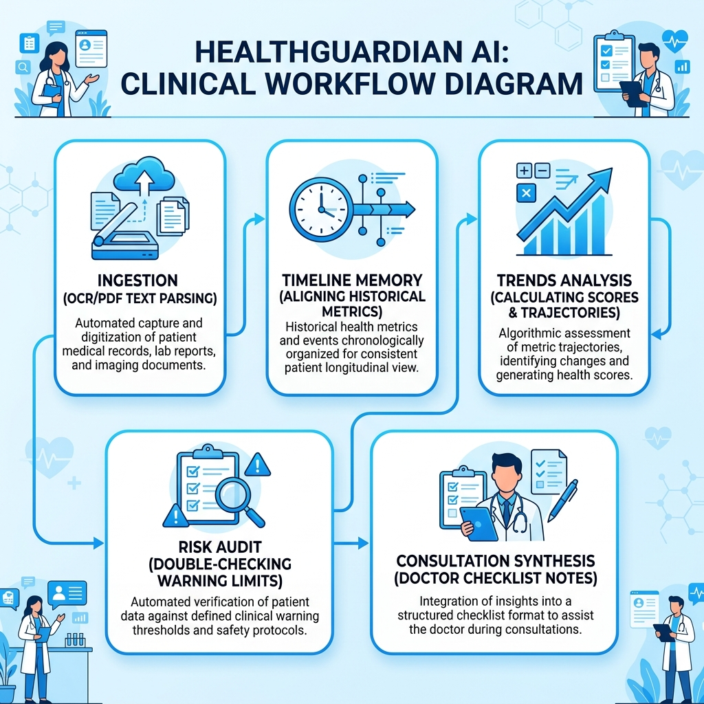
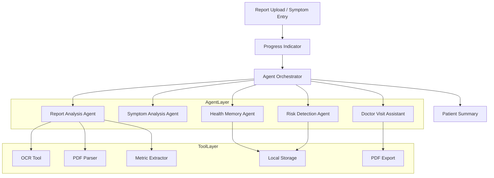

# HealthGuardian AI

An **Agentic Health Intelligence Platform** designed to help users aggregate, compare, and track their laboratory panels and symptom history chronologically over time. 

The system leverages a multi-agent coordination architecture in the background to extract biomarkers, cross-reference historical milestones, run risk screenings, and compile structured clinician consultation checklists.



### The Multi-Agent Clinical Workflow
When a patient uploads a laboratory panel or submits symptom details, HealthGuardian AI triggers a sequenced background pipeline of five specialized AI agents. First, the **Report Analysis Agent** extracts biomarkers using client-side PDF.js/Tesseract.js text parsers. Next, the **Health Memory Agent** queries local database archives to align these values with past history. Third, the **Insight Generation Agent** computes the longitudinal health score and charts the progression trajectory. Fourth, the **Safety & Risk Detection Agent** double-checks values against emergency limits. Finally, the **Doctor Summary Agent** synthesizes consultation notes and check-list questions. This ensures that rather than delivering a simple one-off diagnostic summary, the platform acts as an ongoing tracking operations center, enabling patients to identify trends before they cross into critical bounds.


---

## The Value Proposition: Health Tracking Over Time

Rather than performing one-time, isolated report summaries (which can easily be done via generic chat interfaces), HealthGuardian AI emphasizes **longitudinal tracking**. 

By saving laboratory panels and symptom logs chronologically in a personal timeline, the platform tracks biomarker slopes, measures metabolic changes, and helps patients prepare for consultations with organized progress data.

---

## System Architecture

HealthGuardian AI is structured into four clean layers, keeping the user interface entirely focused on the patient's records while coordinating agent pipelines quietly in the background.



### 1. UI Layer (`src/ui/`)
* Refactored as a clean, bright, professional healthcare SaaS application (modeled after Fitbit and Apple Health).
* Consists of 7 primary patient workspaces:
  - 🏠 **Dashboard:** Recent reports summary, trend charts, active insights, and upcoming tasks.
  - 📄 **Upload Report:** Working drag-and-drop ingestion with real-time text extraction loaders.
  - 🤒 **Symptom Checker:** Structured assessment card (Causes, Triggers, Self-Care, Warnings, Doctor advice).
  - 📈 **Health Trends:** Longitudinal progress curves charting HbA1c, LDL, and TSH values.
  - 📋 **Health Timeline:** Chronological feed of all report and symptom events with collapsible details.
  - 👨⚕️ **Doctor Summary:** Synthesized physician guides and questions checklists with PDF print support.
  - ⚙️ **Settings:** Patient profile setups and local storage database seeding.

### 2. Internal Agent Layer (`src/agents/`)
* **Report Analysis Agent:** Parses reports, extracts biomarkers, and compiles patient-friendly summaries.
* **Symptom Analysis Agent:** Parses natural language descriptions, suggesting possible causes and warning signs.
* **Health Memory Agent:** Aligns current checkups with previous baseline logs to compute fluctuations.
* **Risk Detection Agent:** Verifies out-of-bounds metrics (e.g. Systolic BP >= 160) to insert warnings.
* **Doctor Summary Agent:** Packaging timeline history and questions checklists into clinician briefs.

### 3. Integrated Tool Layer (`src/tools/`)
* **OCR Extractor Tool:** Integrates `Tesseract.js` to recognize text inside uploaded images (PNG, JPG) on the fly, feeding progress percentages back to the UI.
* **PDF Document Parser:** Integrates `PDF.js` to parse select-copyable text inside uploaded PDFs on the fly.
* **Biomarker Metric Extractor:** Pattern-matching regular expressions extracting structured metrics from raw text.
* **Health Trend Analyzer:** Calculates trajectories, health scores, and charts coordinates.
* **LocalStorage Database Tool:** Handles data persistence.
* **PDF Exporter Tool:** Formats consultation note print pages.

---

## Technical Setup & Commands

### Prerequisites
* [Node.js](https://nodejs.org/) (v16+) and npm.

### Installation
Run npm installation to configure Vite:
```bash
npm install
```

### Running Locally (Dev Server)
Start the local server:
```bash
npm run dev
```
Open the printed URL (typically `http://localhost:5173`) in your browser to evaluate.

### Production Compile
To compile and bundle optimized static assets into the `dist/` directory:
```bash
npm run build
```
