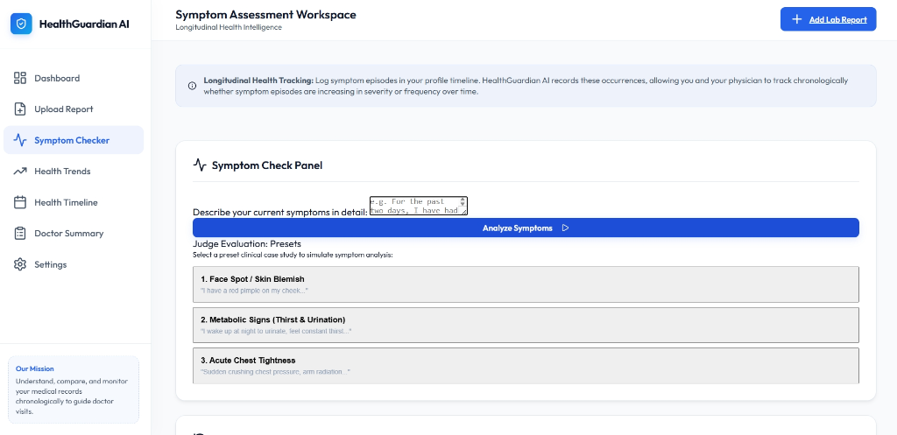
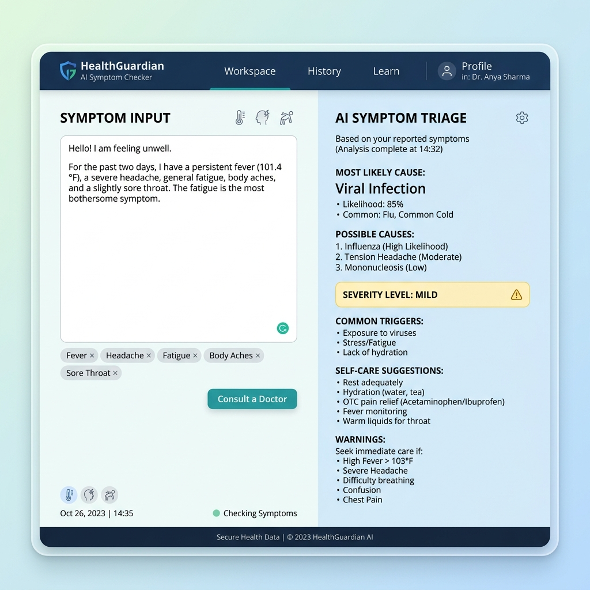
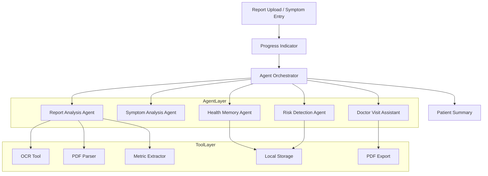

# HealthGuardian AI

An **Agentic Health Intelligence Platform** designed to help users aggregate, compare, and track their laboratory panels and symptom history chronologically over time. 

The system leverages a multi-agent coordination architecture in the background to extract biomarkers, cross-reference historical milestones, run risk screenings, and compile structured clinician consultation checklists.

---

## 🏥 Clinical Workflow Overview

HealthGuardian AI coordinates a pipeline of five specialized AI agents. Rather than delivering a simple one-off static response, the orchestration of these agents guarantees an ongoing tracking operations center that helps patients detect trends before they cross into critical clinical bounds.


### The Multi-Agent Clinical Workflow Explained

When a patient uploads a laboratory panel or submits symptom details, HealthGuardian AI initiates a sequenced, background coordination pipeline of five specialized AI agents:

1. **Report Analysis Agent (Ingestion & Extraction):**
   * **Role:** Analyzes the raw unstructured text extracted via client-side `PDF.js` (for PDF documents) or `Tesseract.js` (OCR for scanned images).
   * **Action:** Matches pattern-based regular expressions and runs semantic extraction to identify biomarkers, unit values, and standard ranges (e.g. HbA1c, LDL-C, TSH). It translates raw, dense medical printouts into clean JSON-formatted biomarker entries.

2. **Health Memory Agent (Historical Recall):**
   * **Role:** Acts as the platform's longitudinal query manager.
   * **Action:** Queries local database archives (powered by `LocalStorage`) to retrieve the user's historical clinical logs. It aligns the newly ingested biomarkers alongside previous baselines, performing comparison analysis to detect short-term and long-term deviations.

3. **Insight Generation Agent (Longitudinal Analysis & Trend Computation):**
   * **Role:** The analytical brain of the dashboard trends.
   * **Action:** Computes a unified longitudinal health score and determines trajectory slopes (e.g., whether cholesterol is rising or thyroid function is stabilizing). It maps out the exact data coordinates used to render interactive progress curves in Chart.js.

4. **Safety & Risk Detection Agent (Guardrails & Alerts):**
   * **Role:** Provides safety checkpoints and clinical out-of-bounds validation.
   * **Action:** Compares extracted biomarker levels and symptoms against established emergency limits (e.g., high systolic blood pressure or critical HbA1c spikes). If critical metrics are detected, it flag-alerts the dashboard, adding vital self-care and emergency warnings without giving unauthorized final diagnoses.

5. **Doctor Summary Agent (Synthesis & Consultation Planner):**
   * **Role:** Prepares the patient for their next physical exam.
   * **Action:** Synthesizes the timeline updates, metabolic changes, and warning flags into a printable Doctor Consultation Brief. It automatically drafts a list of targeted, hyper-relevant questions the patient should ask their primary care provider based on current and past health patterns.

---

## 🛠️ Technology Stack & Libraries

To deliver a high-fidelity client-side experience alongside secure backend intelligence, HealthGuardian AI utilizes the following technologies:

* **Frontend Framework:** Vanilla HTML5, CSS3 Variables, and ES6 Javascript (bundled via **Vite**).
* **Database & Persistence:** **LocalStorage** Database Tool managing patient records, settings, and timeline events in the browser.
* **Optical Character Recognition:** **Tesseract.js** for browser-side image processing and text extraction of photo scans.
* **Document Parser:** **PDF.js** for high-efficiency, multi-threaded text extraction inside copyable PDF records.
* **Data Visualization:** **Chart.js** rendering progress curves for HbA1c, LDL, and TSH biomarkers.
* **AI Orchestration & Backend:** **Express.js** API proxying requests to the **Google Gemini API** (`gemini-2.5-flash`) for clinical reports processing, symptom triage, and medical summary synthesis.
* **Security & Configuration:** **dotenv** configuration managing environment credentials.

---

## 📸 Visual Previews & Workspace Guide

### 1. Dashboard Overview
The main interface displays longitudinal health trends, biomarker tracking panels, and active medical insights.



### 2. Symptom Checker Workspace
Allows patients to log natural language descriptions of symptoms and receive structured assessments categorized by potential causes, triggers, warnings, self-care guidance, and doctor consultation advice.



---

## 📈 Platform Workspaces

HealthGuardian AI is structured into four clean layers, keeping the user interface entirely focused on the patient's records while coordinating agent pipelines quietly in the background.



### 1. UI Layer (`src/ui/`)
Consists of 7 primary patient workspaces:
* 🏠 **Dashboard:** Recent reports summary, trend charts, active insights, and upcoming tasks.
* 📄 **Upload Report:** Working drag-and-drop ingestion with real-time text extraction loaders.
* 🤒 **Symptom Checker:** Structured assessment card (Causes, Triggers, Self-Care, Warnings, Doctor advice).
* 📈 **Health Trends:** Longitudinal progress curves charting HbA1c, LDL, and TSH values.
* 📋 **Health Timeline:** Chronological feed of all report and symptom events with collapsible details.
* 👨⚕️ **Doctor Summary:** Synthesized physician guides and questions checklists with PDF print support.
* ⚙️ **Settings:** Patient profile setups and local storage database seeding.

### 2. Internal Agent Layer (`src/agents/`)
* **Report Analysis Agent:** Parses reports, extracts biomarkers, and compiles patient-friendly summaries.
* **Symptom Analysis Agent:** Parses natural language descriptions, suggesting possible causes and warning signs.
* **Health Memory Agent:** Aligns current checkups with previous baseline logs to compute fluctuations.
* **Risk Detection Agent:** Verifies out-of-bounds metrics (e.g. Systolic BP >= 160) to insert warnings.
* **Doctor Summary Agent:** Packaging timeline history and questions checklists into clinician briefs.

### 3. Integrated Tool Layer (`src/tools/`)
* **OCR Extractor Tool:** Integrates `Tesseract.js` to recognize text inside uploaded images (PNG, JPG) on the fly, feeding progress percentages back to the UI.
* **PDF Document Parser:** Integrates `PDF.js` to parse select-copyable text inside uploaded PDFs on the fly.
* **Biomarker Metric Extractor:** Pattern-matching regular expressions extracting structured metrics from raw text.
* **Health Trend Analyzer:** Calculates trajectories, health scores, and charts coordinates.
* **LocalStorage Database Tool:** Handles data persistence.
* **PDF Exporter Tool:** Formats consultation note print pages.

---

## ⚙️ Technical Setup & Commands

### Prerequisites
* [Node.js](https://nodejs.org/) (v16+) and npm.

### Installation
Run npm installation to configure Vite:
```bash
npm install
```

### Running Locally (Dev Server)
Start the local server:
```bash
npm run dev
```
Open the printed URL (typically `http://localhost:5173`) in your browser to evaluate.

### Production Compile
To compile and bundle optimized static assets into the `dist/` directory:
```bash
npm run build
```
